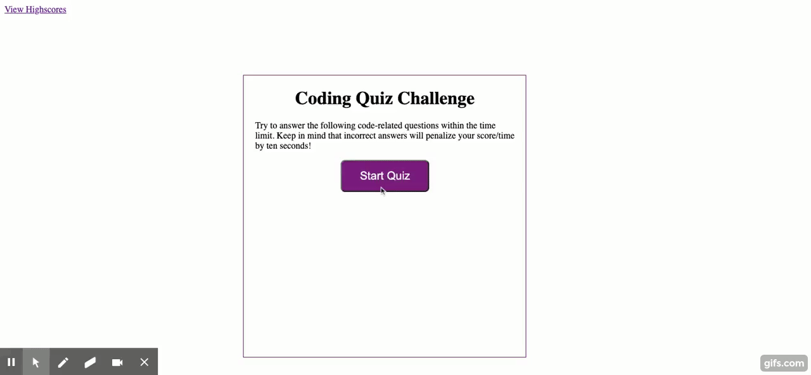

# Código-Quiz

Este projeto foi concebido como uma tarefa de casa para o bootcamp de codificação da UNH.

Este é um aplicativo de quiz usando HTML, CSS e Javascript. Este aplicativo enfatiza o uso de Javascript para fornecer perguntas do questionário e coletar dados do usuário para determinar se as respostas a uma pergunta estão corretas, isso gera uma pontuação e anexa uma página final de resultados dos dados do usuário.

Este projeto foi implantado no GitHub Pages. Para colocar este projeto em funcionamento, você pode seguir o link situado abaixo. Ou baixe os arquivos de fontes para usá-los em visualização local.

* [Repositório do GitHub](https://github.com/jamierachael/Code-Quiz)
* [Implantado GitHub IO](https://jamierachael.github.io/Code-Quiz/)
* [Vídeo de demonstração completo](https://drive.google.com/file/d/1Vwszd5-rVd5LQKwpRoxpXqu_1eiH3uDI/view)

### Pré-requisitos

Para instalar este aplicativo, você precisará de um editor de texto. Eu recomendo o Visual Studio Code.

### Instalando

Para instalar esse código, baixe o arquivo zip ou use as diretrizes do GitHub para clonar o repositório.

### Resumo
* Documentos HTML e CSS e Javascript criam um quiz com perguntas de múltipla escolha com curiosidades sobre Javascript
* Este projeto enfatiza o uso de Javascript para fazer alterações dinâmicas em um documento HTML
* Este projeto utiliza o uso de páginas HTML anexadas

### Este projeto possui as seguintes características:
* Um botão Iniciar questionário
    * Isso inicia um cronômetro para o usuário
    * Cada questão tem uma média de 15 segundos cada para um tempo total de 75 segundos + 1.

* Uma página HTML anexada que apresenta perguntas e respostas de múltipla escolha
    * Se as perguntas forem respondidas incorretamente, 5 segundos serão deduzidos do tempo restante
    * As respostas são gravadas usando um ouvinte de eventos, "clique" e rastreia as respostas corretas

* Uma página HTML anexada que apresenta:
    * Pontuação final que é calculada usando o tempo restante
    * Um resumo de quantas perguntas respondidas corretamente
    * Área de entrada para gravar iniciais
    * Um botão Enviar
    * O botão Enviar salva as iniciais e a pontuação no armazenamento local

* Um HTML de recordes
    * Este é um resumo da lista de pontuações iniciais e finais
    * O botão Limpar redefine a página e o armazenamento local
    * O botão Voltar viaja para o início do questionário

### Pseudo código:
* Crie um temporizador anexado a um botão com um valor inicial de 0
* Quando o temporizador é pressionado, inicia uma contagem regressiva reversa
* Crie um 0 para contagem regressiva
* Quando a contagem regressiva começar, inicie o questionário
* Iniciar Quiz estará na página anexada
* Acrescente a pergunta: escolhas
* Quando o usuário seleciona a resposta certa, o conteúdo de texto "Correto!"
* Quando o usuário seleciona a resposta certa, textcontent "Wrong!"
* A pontuação final acompanhará quantos o usuário acertou
* O tempo restante será deduzido da pontuação final
* Página anexada à pontuação final
* Captura armazenamento local
* Viaja para outro HTML
* Recordes recuperados

### Este projeto possui recursos de script de:
* Perguntas contidas em uma variável array com objetos
* Área de declaração de variável
* Um ouvinte de eventos (onclick) que gera intervalo de tempo
* Uma função para renderizar as perguntas e escolhas na página usando um loop for
* Um ouvinte de eventos em todas as opções da lista
* Uma declaração de comparação para comparar as respostas corretas às escolhas
* Uma página anexada mostrando as estatísticas finais do usuário individual com área de entrada para iniciais, captura o armazenamento local
* Recordes de armazenamento local recuperados

### Este projeto tem consultas de mídia para:
* largura máxima: 980px
    * Ajusta a largura do corpo e do recipiente
* largura máxima: 786px
    * Ajusta a largura do corpo e do recipiente
    * Ajusta os botões
* largura máxima: 640px
    * Ajusta a largura do corpo e do recipiente
    * Ajusta os botões para serem centralizados e empilhados

### Para executar o arquivo:
> Abrir no navegador

### Características:
* Duas páginas HTML
    * Index.html
        * Contém página de destino para iniciar o temporizador
        * Anexa duas novas páginas
* Notas altas
        * Recupera dados locais da página anterior
* Uma página CSS
    * Estilos.css
        * Contém centralização e estilo para recursos de lista html
        * Contém consultas de mídia
* Duas Páginas Javascript
        * Contém:
        * Variáveis, incluindo arrays com objeto
        * Ouvintes de eventos
        * if/else if declarações
        * Para laços
        * Funções
        * Conjunto de armazenamento local e obter

## Autores

* **Jamie Rachael Morris** - *Trabalho inicial* - [Perfil do Git Hub](https://github.com/jamierachael)
* Desenho do Projeto UNH

## Agradecimentos

* Dica de chapéu para UNH por fornecer parâmetros de projeto e exemplos de código